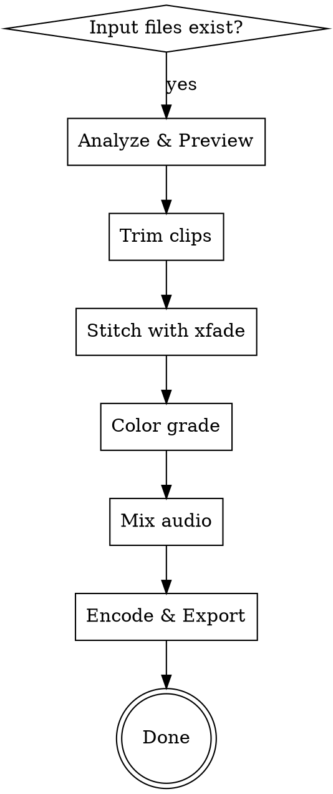
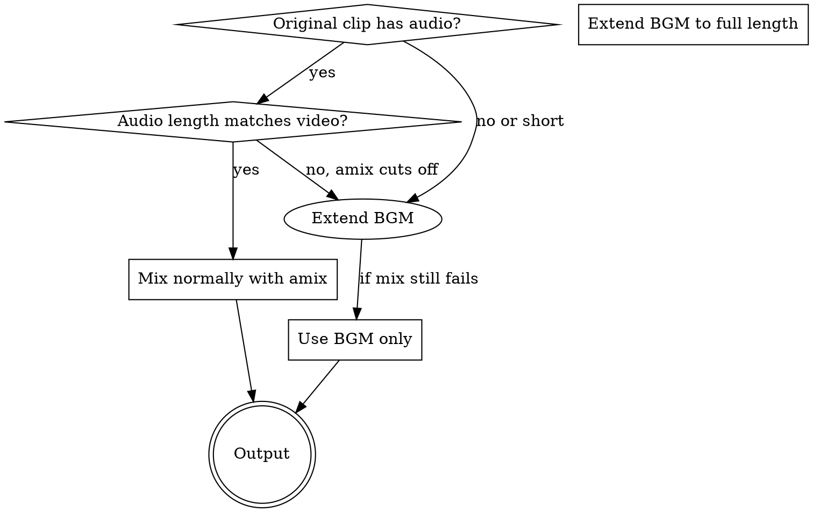

# 剪辑 (Clip)

使用 FFmpeg 从原始素材中提取、编辑和导出 Vlog 视频。

## 工作流



1. **分析预览**: 查看时长、编码，提取首帧选片段
2. **裁剪**: 切割为 3-5 秒片段
3. **拼接转场**: 用 `xfade` 融合
4. **调色**: 暖色调滤镜
5. **混音**: 环境音 30% + 背景音乐 70%
6. **编码导出**: 高兼容性格式

## 快速参考

| 操作 | 命令 |
|------|------|
| 查看时长 | `ffprobe -v error -show_entries format=duration -of csv=p=0 input.mp4` |
| 提取首帧 | `ffmpeg -i input.mp4 -vf "fps=1,scale=320:-1" -frames:v 1 frame.jpg` |
| 裁剪片段 | `ffmpeg -i input.mp4 -t <秒数> -c copy output.mp4` |
| 添加转场 | `xfade=transition=fade:duration=0.5:offset=<计算值>` |
| 调色 | `eq=brightness=0.05:saturation=1.1:contrast=1.1` |
| 混音 | `[0:a]volume=0.3[a1];[1:a]volume=0.7[a2];[a1][a2]amix=inputs=2:duration=longest` |
| 导出编码 | `-c:v libx264 -pix_fmt yuv420p -c:a aac -ar 48000 -crf 20` |

## 转场偏移量计算

使用 `xfade` 时，每个转场的 `offset` 计算公式：

```
offset = 前序片段累计时长 - (转场时长 × 前序转场数量)
```

**示例**: 7 个片段，每个 3s，转场 0.5s
- 第 1 个转场 offset = 3.0 - 0 = 3.0 → **2.5** (减去转场时长)
- 第 2 个 offset = 6.0 - 0.5 = **5.5**
- 第 3 个 offset = 9.0 - 1.0 = **8.5**

## 音频混音最佳实践



- **原始音频完整**: `[0:a]volume=0.3[a1];[1:a]volume=0.7[a2];[a1][a2]amix=inputs=2:duration=longest`
- **原始音频缺失/短**: 直接用背景音乐，用 `atrim` 截取视频时长
- **采样率不匹配**: 原始音频是 48kHz 但 BGM 是 44.1kHz → **用 48kHz 生成 BGM**

## 编码兼容性（最常见报错）

**设备无法播放**: 默认编码是 `yuv444p`，多数设备不兼容。
```bash
# 必须强制指定
-c:v libx264 -pix_fmt yuv420p
```

**音频断续/无声**: 采样率混用 (44.1k vs 48k) 导致。
```bash
# 必须统一
-ar 48000
```

**完整导出命令模板**:
```bash
ffmpeg -i vlog_raw.mp4 -i bgm.wav -filter_complex "[1:a]atrim=0:<视频时长>[a]" \
  -map 0:v -map "[a]" -c:v libx264 -pix_fmt yuv420p -crf 20 -preset fast \
  -c:a aac -ar 48000 -b:a 192k -shortest vlog_final.mp4
```

## 常见错误

| 错误 | 原因 | 修复 |
|------|------|------|
| 播放黑屏/花屏 | `yuv444p` 编码不兼容 | 加 `-pix_fmt yuv420p` |
| 音频只响 2 秒 | 原片段音频短，amix 以短为准 | BGM 用 `atrim` 截取全长 |
| 音频断续无声 | 采样率 44.1k/48k 混用 | 统一 `-ar 48000` |
| 音画不同步 | 帧率/采样率不一致 | 加 `-ar 48000` 并检查视频帧率 |
| 导出太慢 | `-preset slow` | 改为 `-preset fast` |
| 文件过大 | `-crf` 太低 | 调到 `-crf 20` 左右 |
