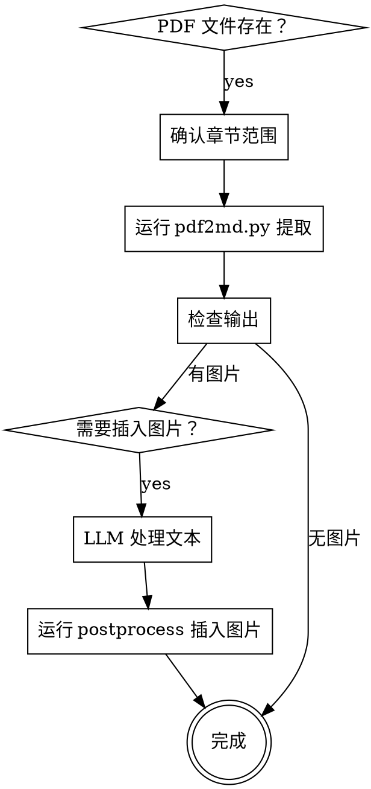

# PDF 转 Markdown（pdf2md）

从 PDF 中提取文字和图片，按阅读顺序输出为 Markdown，保留章节结构和页面标记。

核心原则：**还原 PDF 的阅读顺序，不打乱、不翻译、不丢弃。**

## 工作流



### 1. 确认章节范围

两种方式：

- **手动指定**：`--chapters "Ch1:1-10,Ch2:11-30"` —— 格式为 `章节名:起始页-结束页`
- **自动检测**：`--toc` —— 从目录页自动解析章节

如果不指定，脚本会自动尝试从目录页检测。

### 2. 运行提取

```bash
# 手动指定章节
python scripts/pdf2md.py input.pdf --chapters "Ch1:1-10,Ch2:11-20" -o output_dir/

# 自动从目录检测
python scripts/pdf2md.py input.pdf --toc -o output_dir/
```

### 3. 检查输出

输出目录结构：

```
output_dir/
├── metadata.json            # 源文件、总页数、章节信息
├── images/                  # 提取的图片（按章节重命名）
│   ├── Ch1_p5_Im0.png
│   └── Ch2_p15_Im0.jpg
└── chapters/                # 每章的 Markdown 和元数据
    ├── Ch1_source.md
    ├── Ch1_meta.json
    ├── Ch2_source.md
    └── Ch2_meta.json
```

`_source.md` 中：
- `<!-- page N -->` 标记每页起始
- `<!-- IMG src=xxx -->` 标记图片位置
- 文字按阅读顺序排列，标题自动识别

### 4. 后处理（需要时）

如果 source.md 被 LLM 处理过（比如格式整理），需要用 postprocess 将图片按比例插回：

```bash
python scripts/pdf2md-postprocess.py <处理后的.md> <meta.json> <images目录>
```

原理：根据 `meta.json` 中的每页行数和图片位置，按比例计算图片在目标文档中的插入点。

## 快速参考

| 操作 | 命令 |
|------|------|
| 基本提取 | `python scripts/pdf2md.py input.pdf -o out/` |
| 指定章节 | `python scripts/pdf2md.py input.pdf --chapters "Ch1:1-10" -o out/` |
| 自动目录检测 | `python scripts/pdf2md.py input.pdf --toc -o out/` |
| 图片后处理 | `python scripts/pdf2md-postprocess.py translated.md meta.json images/` |

## 依赖

```bash
pip install pdfplumber
```

`mutool` 用于图片提取（可选，提取失败时图片位会保留但缺文件）：

```bash
# Ubuntu/Debian
sudo apt install mupdf-tools
# macOS
brew install mupdf-tools
```

## 常见问题

| 问题 | 原因 | 处理 |
|------|------|------|
| 章节检测不准 | 目录格式不标准 | 改用 `--chapters` 手动指定页码 |
| 图片提取失败 | 缺少 `mutool` | 安装 mupdf-tools 或接受缺图 |
| 正文顺序错乱 | 多栏排版 | pdfplumber 按 top→x0 排序，多栏可能需要调整 |
| 标题未识别 | 字体无 Bold 属性 | 检查字体嵌入，或后期手动标注 |
| 后处理图片位置偏移 | LLM 处理改变了行数分布 | 按比例插值是近似值，手工微调 |

## 使用边界

- **只负责格式转换，不翻译内容。** 如果需要翻译，那是另一个工作流。
- 适合**文字为主的 PDF**（论文、报告、书籍）。扫描件需要先 OCR。
- 多栏排版阅读顺序**可能不完美**，取决于 pdfplumber 的字符排序。
- 复杂表格不还原为 Markdown 表格，保持原始文字排列。
